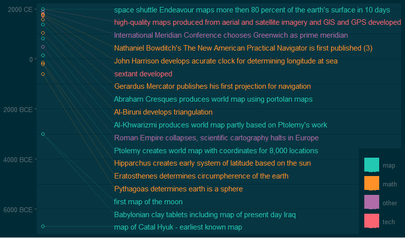

# Cartography Timeline
Date: `r Sys.Date()`  

This report covers the analyses used in the ZZZ project (Marcus Mark, PI).

<!--  Set the working directory to the repository's base directory; this assumes the report is nested inside of two directories.-->


<!-- Set the report-wide options, and point to the external code file. -->


<!-- Load 'sourced' R files.  Suppress the output when loading sources. --> 


<!-- Load packages, or at least verify they're available on the local machine.  Suppress the output when loading packages. --> 


<!-- Load any global functions and variables declared in the R file.  Suppress the output. --> 


<!-- Declare any global functions specific to a Rmd output.  Suppress the output. --> 


<!-- Load the datasets.   -->


<!-- Tweak the datasets.   -->


# Summary

# Graph on Continuous Time
<!-- -->

# Session Information
For the sake of documentation and reproducibility, the current report was rendered on a system using the following software.

```
Report rendered by wibeasley at 2017-01-15, 14:40 -0600 in 1 seconds.
```

```
R version 3.3.1 (2016-06-21)
Platform: x86_64-pc-linux-gnu (64-bit)
Running under: Ubuntu 16.04.1 LTS

locale:
 [1] LC_CTYPE=en_US.UTF-8       LC_NUMERIC=C               LC_TIME=en_US.UTF-8       
 [4] LC_COLLATE=en_US.UTF-8     LC_MONETARY=en_US.UTF-8    LC_MESSAGES=en_US.UTF-8   
 [7] LC_PAPER=en_US.UTF-8       LC_NAME=C                  LC_ADDRESS=C              
[10] LC_TELEPHONE=C             LC_MEASUREMENT=en_US.UTF-8 LC_IDENTIFICATION=C       

attached base packages:
[1] stats     graphics  grDevices utils     datasets  methods   base     

other attached packages:
[1] magrittr_1.5  ggplot2_2.2.1 knitr_1.15.1 

loaded via a namespace (and not attached):
 [1] Rcpp_0.12.9        munsell_0.4.3      colorspace_1.3-2   R6_2.2.0           stringr_1.1.0     
 [6] plyr_1.8.4         dplyr_0.5.0.9000   tools_3.3.1        grid_3.3.1         gtable_0.2.0      
[11] DBI_0.5-1          ggthemes_3.3.0     htmltools_0.3.5    yaml_2.1.14        lazyeval_0.2.0    
[16] rprojroot_1.1      digest_0.6.11      assertthat_0.1     tibble_1.2         readr_1.0.0       
[21] RColorBrewer_1.1-2 evaluate_0.10      rmarkdown_1.3      labeling_0.3       stringi_1.1.2     
[26] scales_0.4.1       backports_1.0.4   
```
