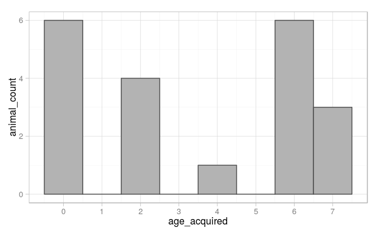
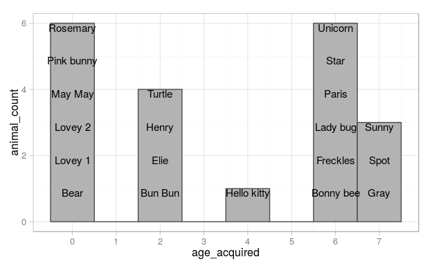

# Stuffed Animals -Descriptive Statistics Report

This report describes the existing collection of Maya's stuffed animals.

<!--  Set the working directory to the repository's base directory; this assumes the report is nested inside of two directories.-->


<!-- Set the report-wide options, and point to the external code file. -->


<!-- Load the sources.  Suppress the output when loading sources. --> 


<!-- Load 'sourced' R files.  Suppress the output when loading packages. --> 


<!-- Load any global functions and variables declared in the R file.  Suppress the output. --> 


<!-- Declare any global functions specific to a Rmd output.  Suppress the output. --> 


<!-- Load the datasets.   -->


<!-- Tweak the datasets.   -->


# Notes

1. The current report covers 20 animals.  These include only the animals that still exist in our house, and not the ones that have been lost or donated.

2. This list is incomplete.  There are still more animals in the house that have yet to be added to the inventory.

# Marginals
Here are the first two graphs we made.  The first one shows how many of the existing animals Maya received at each year of her life.  The second graph is like the first, but lists the animal names on top of the bars.

  

# Data Table
In this table, each row represents one animal.  The characteristic of each animal are displayed as columns.


|animal_name | age_acquired|favorite |donor            | within_age_order|
|:-----------|------------:|:--------|:----------------|----------------:|
|Bear        |            0|FALSE    |NA               |                1|
|Lovey 1     |            0|TRUE     |Margaret Trulock |                2|
|Lovey 2     |            0|TRUE     |Mama             |                3|
|May May     |            0|TRUE     |NA               |                4|
|Pink bunny  |            0|FALSE    |Gigi's friend    |                5|
|Rosemary    |            0|TRUE     |NA               |                6|
|Bun Bun     |            2|FALSE    |NA               |                1|
|Elie        |            2|TRUE     |Liza Raynor      |                2|
|Henry       |            2|FALSE    |Liza Raynor      |                3|
|Turtle      |            2|TRUE     |Sharin & Eric    |                4|
|Hello kitty |            4|FALSE    |Grammy           |                1|
|Bonny bee   |            6|FALSE    |William          |                1|
|Freckles    |            6|FALSE    |Grammy           |                2|
|Lady bug    |            6|FALSE    |Xavier           |                3|
|Paris       |            6|FALSE    |William          |                4|
|Star        |            6|FALSE    |Grammy           |                5|
|Unicorn     |            6|FALSE    |Grammy           |                6|
|Gray        |            7|TRUE     |Magnus           |                1|
|Spot        |            7|TRUE     |Mama             |                2|
|Sunny       |            7|FALSE    |Public library   |                3|

# Session Information
For the sake of documentation and reproducibility, the current report was rendered on a system using the following software.


```
Report rendered by mmbeasley at 2015-10-11, 12:51 -0500
```

```
R version 3.2.1 (2015-06-18)
Platform: x86_64-pc-linux-gnu (64-bit)
Running under: Ubuntu 15.04

locale:
 [1] LC_CTYPE=en_US.UTF-8       LC_NUMERIC=C               LC_TIME=en_US.UTF-8        LC_COLLATE=en_US.UTF-8    
 [5] LC_MONETARY=en_US.UTF-8    LC_MESSAGES=en_US.UTF-8    LC_PAPER=en_US.UTF-8       LC_NAME=C                 
 [9] LC_ADDRESS=C               LC_TELEPHONE=C             LC_MEASUREMENT=en_US.UTF-8 LC_IDENTIFICATION=C       

attached base packages:
[1] stats     graphics  grDevices utils     datasets  methods   base     

other attached packages:
[1] magrittr_1.5  ggplot2_1.0.1 knitr_1.11   

loaded via a namespace (and not attached):
 [1] Rcpp_0.12.1      MASS_7.3-42      munsell_0.4.2    colorspace_1.2-6 R6_2.1.1         highr_0.5.1     
 [7] stringr_1.0.0    plyr_1.8.3       dplyr_0.4.3      tools_3.2.1      parallel_3.2.1   grid_3.2.1      
[13] gtable_0.1.2     DBI_0.3.1        htmltools_0.2.6  lazyeval_0.1.10  yaml_2.1.13      digest_0.6.8    
[19] assertthat_0.1   reshape2_1.4.1   formatR_1.2.1    evaluate_0.8     rmarkdown_0.7.3  labeling_0.3    
[25] stringi_0.5-5    scales_0.3.0     proto_0.3-10    
```
