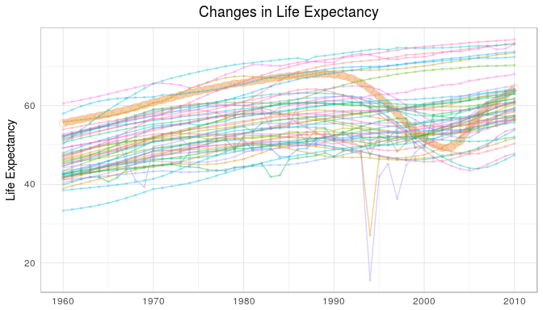
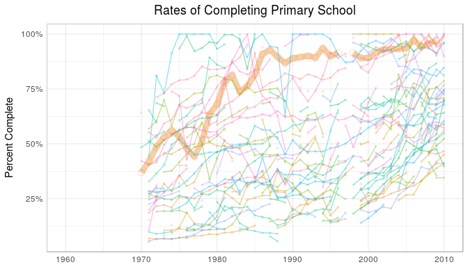

# Botswana Graphs
William Beasley, CMS 1st Grade  
Date: `r Sys.Date()`  

This report covers the graphs of life.

<!--  Set the working directory to the repository's base directory; this assumes the report is nested inside of two directories.-->


<!-- Set the report-wide options, and point to the external code file. -->


<!-- Load 'sourced' R files.  Suppress the output when loading sources. --> 


<!-- Load packages, or at least verify they're available on the local machine.  Suppress the output when loading packages. --> 


<!-- Load any global functions and variables declared in the R file.  Suppress the output. --> 


<!-- Declare any global functions specific to a Rmd output.  Suppress the output. --> 


<!-- Load the datasets.   -->


<!-- Tweak the datasets.   -->


# Summary

### Notes 
1. The data is publically available from [Gapminder.org](https://www.gapminder.org/data/).
1. The current report covers 51 years.

### Unanswered Questions
1. How does these countries compare to North America?

 
### Answered Questions


# Spaghetti Plots

### Life Expectancy

<!-- -->

### Primary School Completion

Primary completion rate is the percentage of students completing the last year of primary school. It is calculated by taking the total number of students in the last grade of primary school, minus the number of repeaters in that grade, divided by the total number of children of official graduation age. The ratio can exceed 100% due to over-aged and under-aged children who enter primary school late/early and/or repeat grades. United Nations Educational, Scientific, and Cultural Organization (UNESCO) Institute for Statistics.<!-- -->

### Food Supply

The total supply of food available in a country, divided by the population and 365 (the number of days in the year).

Kilocalories available, on average, for each person, each day. Calories measures the energy content of the food. The required intake per day varies depending on sveral factors, e.g. activity level, weight, gender and age, but it is normally in the range of 1500-3000 kilocalories per day. One banana contains approximatley 100 kilocalories.

Source: Gapminder and http://www.fao.org/faostat/en/#data/CC<!-- -->

### Population Density

The number of people in a country, divided by the amount land area.<!-- -->


# Session Information
For the sake of documentation and reproducibility, the current report was rendered on a system using the following software.

```
Report rendered by wibeasley at 2017-01-27, 21:13 -0600 in 5 seconds.
```

```
R version 3.3.1 (2016-06-21)
Platform: x86_64-pc-linux-gnu (64-bit)
Running under: Ubuntu 16.04.1 LTS

locale:
 [1] LC_CTYPE=en_US.UTF-8       LC_NUMERIC=C               LC_TIME=en_US.UTF-8       
 [4] LC_COLLATE=en_US.UTF-8     LC_MONETARY=en_US.UTF-8    LC_MESSAGES=en_US.UTF-8   
 [7] LC_PAPER=en_US.UTF-8       LC_NAME=C                  LC_ADDRESS=C              
[10] LC_TELEPHONE=C             LC_MEASUREMENT=en_US.UTF-8 LC_IDENTIFICATION=C       

attached base packages:
[1] stats     graphics  grDevices utils     datasets  methods   base     

other attached packages:
[1] magrittr_1.5  ggplot2_2.2.1 knitr_1.15.1 

loaded via a namespace (and not attached):
 [1] Rcpp_0.12.9        munsell_0.4.3      lattice_0.20-34    colorspace_1.3-2   R6_2.2.0          
 [6] stringr_1.1.0      plyr_1.8.4         dplyr_0.5.0.9000   tools_3.3.1        grid_3.3.1        
[11] nlme_3.1-128       gtable_0.2.0       mgcv_1.8-16        DBI_0.5-1          htmltools_0.3.5   
[16] yaml_2.1.14        lazyeval_0.2.0     rprojroot_1.1      digest_0.6.11      assertthat_0.1    
[21] tibble_1.2         Matrix_1.2-7.1     readr_1.0.0        tidyr_0.6.1        RColorBrewer_1.1-2
[26] evaluate_0.10      rmarkdown_1.3      labeling_0.3       stringi_1.1.2      scales_0.4.1      
[31] backports_1.0.4   
```
